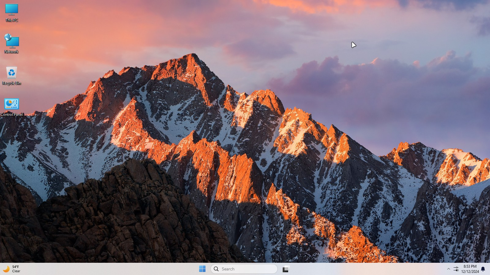
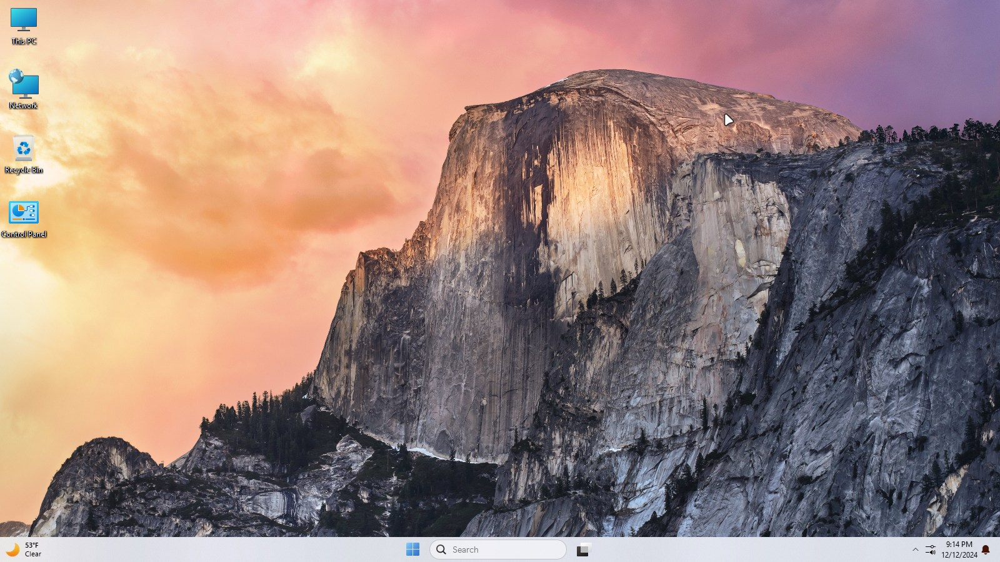
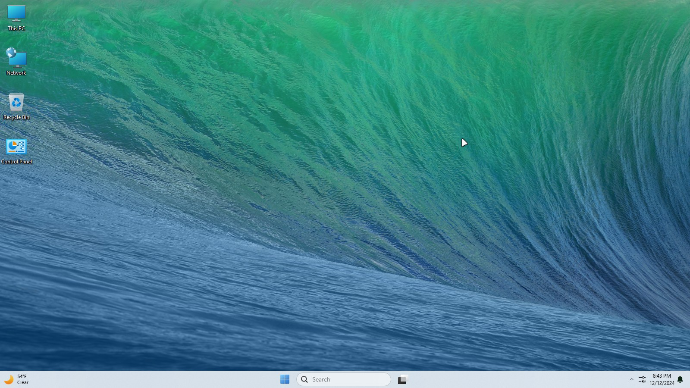
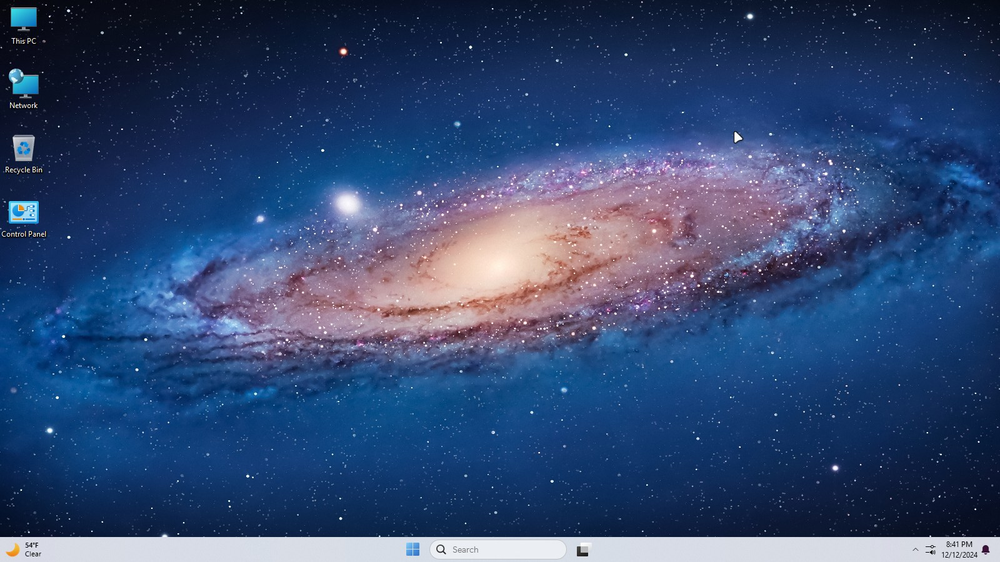
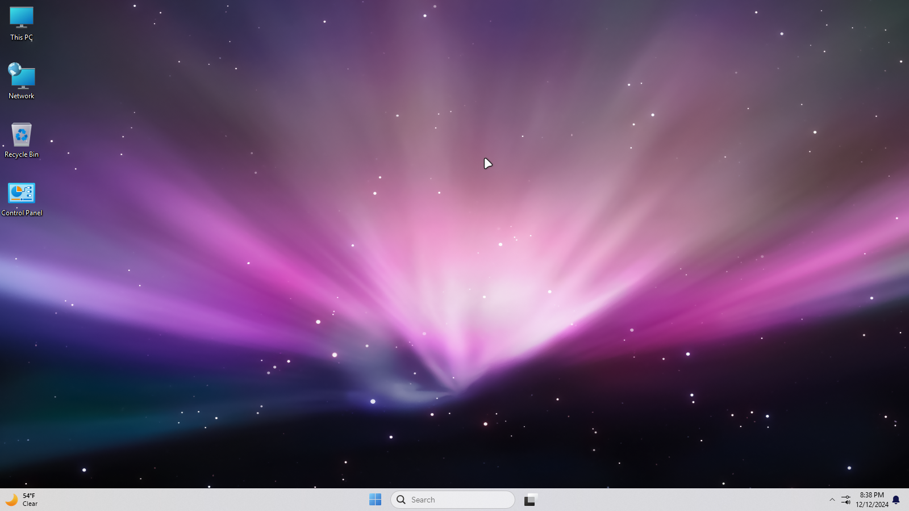
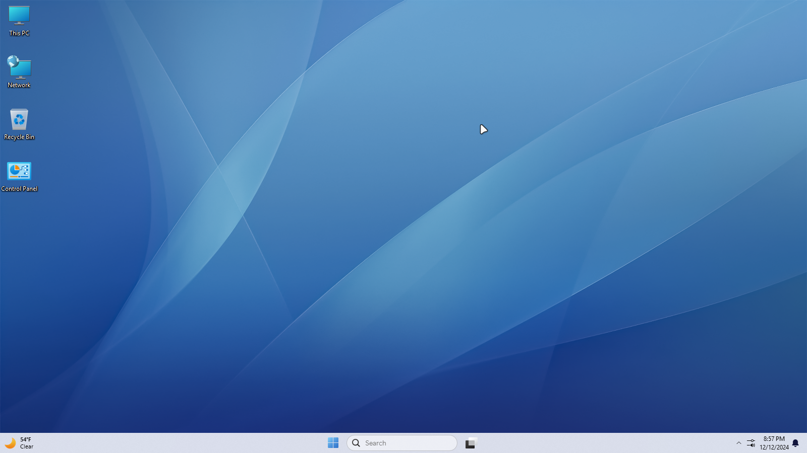
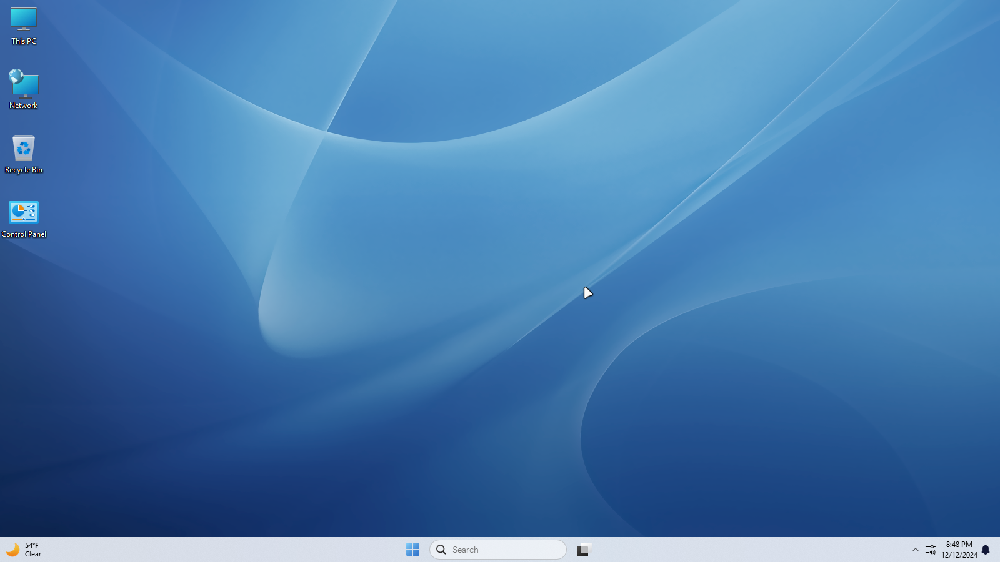
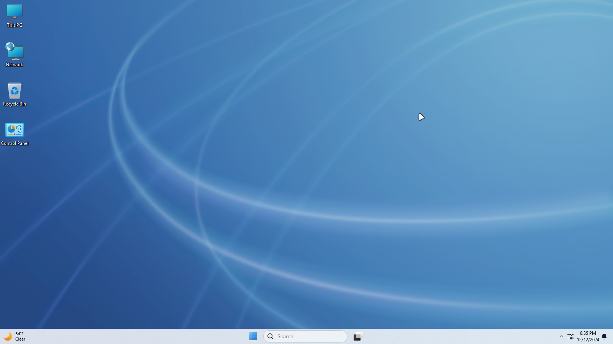
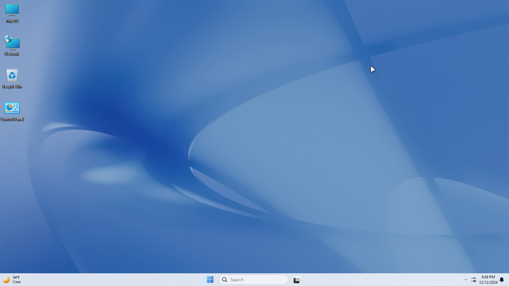

High Sierra

<!-- 

 -->

Sierra

<!-- 

 -->

El Capitan

<!-- 

 -->

Yosemite

<!-- 

 -->

Mavericks

<!-- 

 -->

Mountain Lion

<!-- 

 -->

Lion

<!-- 

 -->

Snow Leopard

<!-- 

 -->

Snow Leopard Alt

<!-- 

 -->

Leopard

<!-- 

 -->

Tiger

<!-- 

 -->

Panther

<!-- 

 -->

Jaguar

<!-- 

 -->

Puma

<!-- 

 -->